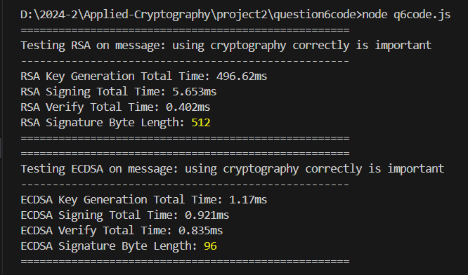

# Short-answer questions

1. In our implementation, Alice and Bob increment their Diffie-Hellman ratchets every time they
exchange messages. Could the protocol be modified to have them increment the DH ratchets
once every ten messages without compromising confidentiality against an eavesdropper (i.e.,
semantic security)? 
=> Yes, the protocol could be modified. As long as the core principle of semantic security is maintained – that an eavesdropper observing the ciphertext cannot learn anything about the plaintext message – it's possible to increment the DH ratchets less frequently. The crucial aspect is that each message is still encrypted using a unique and unpredictable encryption key, derived through a cryptographic process. While incrementing less frequently than every message might reduce computational overhead, it's essential to carefully analyze the potential impact on other security properties like forward secrecy before making such a change. The increased time period between DH ratchet rotations means if a key were exposed, a larger range of past messages could be compromised.

2. What if they never update their DH keys at all? Please explain the security consequences of
this change with regards to Forward Secrecy and Break-in Recovery 
=> If Alice and Bob never update their DH keys, the protocol loses both Forward Secrecy and Break-in Recovery:

    - Forward Secrecy: Without DH ratcheting, all message keys are derived from a single initial root key using the chain key ratchet (HKDF). If an attacker compromises the root key or a later chain key, they can recompute all past chain keys and decrypt all previous messages, as no new entropy is introduced via DH exchanges. With DH ratcheting, past keys are independent of compromised keys due to the Diffie-Hellman problem, ensuring past messages remain secure.
    - Break-in Recovery: Without DH updates, if an attacker compromises the current state (e.g., root and chain keys), they can decrypt all future messages because the key derivation remains predictable (purely HKDF-based). With DH ratcheting, a new DH exchange (e.g., Alice sending Bob a message outside the attacker’s control) introduces fresh entropy, making future keys uncomputable by the attacker, thus restoring security.

3. 
- Alice’s longest sending chain: 2. In the Double Ratchet Algorithm, a sending chain is incremented for each message sent until a DH ratchet occurs (triggered by receiving a message with a new DH public key). Alice sends her first two messages consecutively (no response from Bob), so her sending chain grows to 2. When Bob responds, Alice’s DH ratchet advances, resetting her sending chain to 0. Her third message starts a new chain of length 1. Thus, her longest sending chain is 2 (from the first two messages).
- Bob’s longest sending chain: 1. Bob sends his first message after receiving Alice’s second message, starting a sending chain of length 1. His DH ratchet advances when Alice responds with her third message, resetting his sending chain. His second message starts a new chain of length 1. Since Bob never sends consecutive messages without a DH ratchet, his longest sending chain is 1.

4. The relevant security property here is Forward Secrecy. Mallory's compromise occurred after the message containing the locker combination was sent. The Double Ratchet algorithm ensures that each message is encrypted with a unique, ephemeral key derived from a complex chain of cryptographic operations. The key used to encrypt the message containing the locker combination was based on past DH exchanges and the sending chain at that time. Even though Mallory possesses Alice's current keys after the compromise, she does not have the key used to encrypt the message containing the locker combination. Because those intermediate keys aren't stored long-term and are derived through the ratchet process, she cannot reconstruct it. This is forward secrecy in action.

5. Government surveillance often struggles with the scale of modern communication, leading to high costs and potential for errors or circumvention. Key risks include: privacy violations, potential for abuse (targeting dissent), loss of effectiveness if discovered, and reliance on flawed algorithms. This makes it difficult to achieve intended goals while safeguarding civil liberties.

6. 
